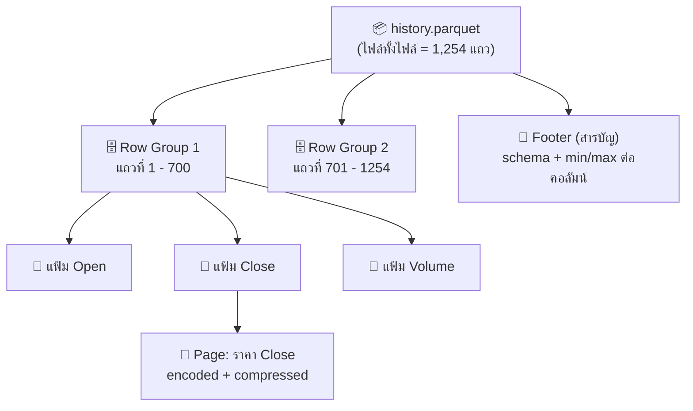
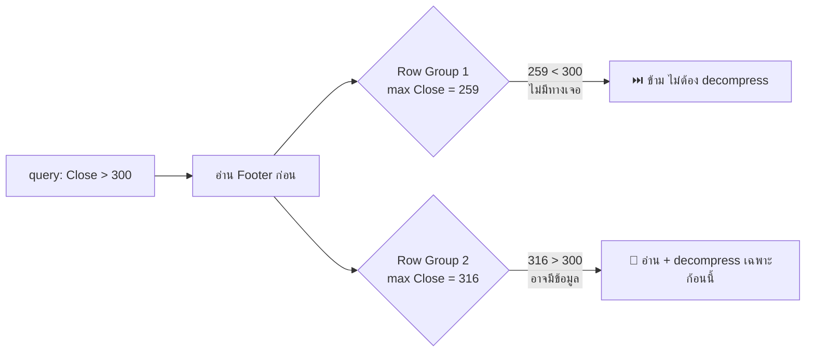
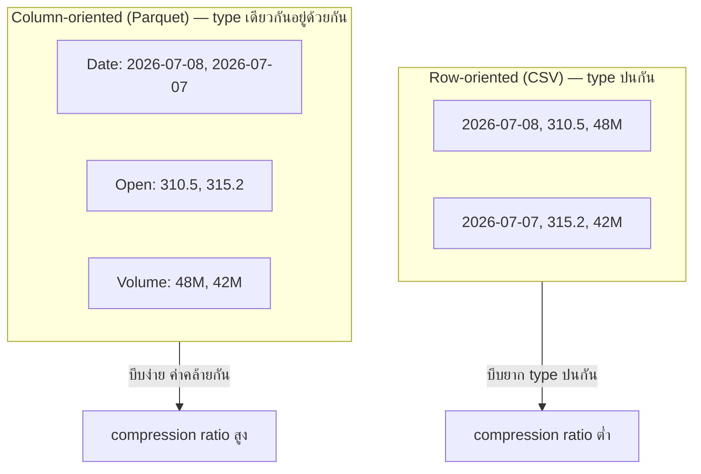
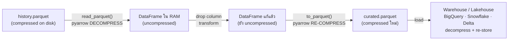
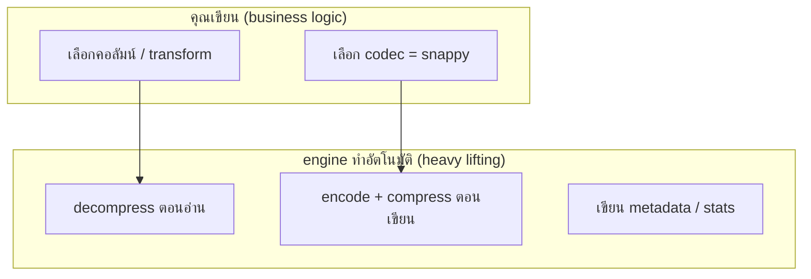
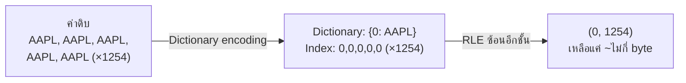
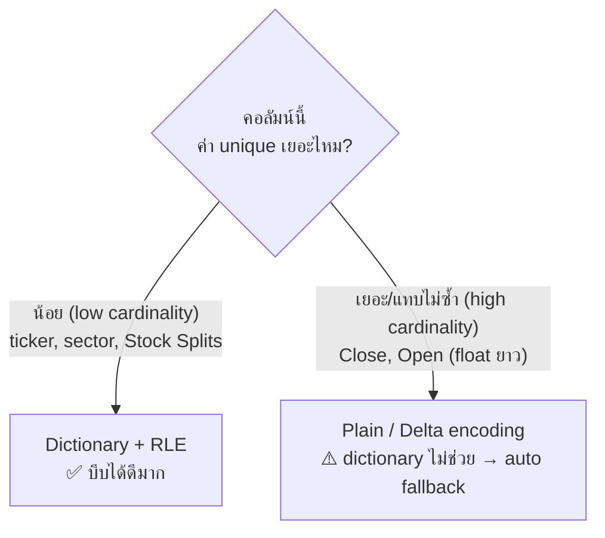

# Parquet Compression Notes

## 0. ภาพรวม: โครงสร้างไฟล์ Parquet

### เปรียบเทียบง่าย ๆ: Parquet เหมือน "ตู้เก็บเอกสารแบบมีลิ้นชัก"

- **ไฟล์ทั้งไฟล์** = ตู้ 1 ใบ
- **Row Group** = ลิ้นชัก 1 อัน (เก็บข้อมูลก้อนหนึ่ง เช่น 1,254 แถวแบ่งเป็นหลายลิ้นชัก)
- **Column Chunk** = แฟ้มในลิ้นชัก แยกตามคอลัมน์ (แฟ้ม Open, แฟ้ม Close, แฟ้ม Volume)
- **Page** = กระดาษในแฟ้ม ที่ถูกบีบอัดจริง ๆ
- **Footer** = สารบัญท้ายตู้ บอกว่าของอยู่ลิ้นชักไหน + สถิติ min/max

> ประโยชน์: อยากได้แค่คอลัมน์ `Close` → เปิดเฉพาะแฟ้ม Close ไม่ต้องรื้อทั้งลิ้นชัก (นี่คือข้อดีของ columnar)

### ตัวอย่างจากข้อมูลหุ้น AAPL (1,254 แถว)



อ่านจากบนลงล่าง: ไฟล์ → แบ่งเป็นก้อนแถว (Row Group) → ในแต่ละก้อนแยกเก็บทีละคอลัมน์ (Column Chunk) → ข้อมูลจริงบีบอัดอยู่ใน Page ส่วน Footer เป็นสารบัญให้ engine ข้ามไปอ่านเฉพาะส่วนที่ต้องการ

### Footer — สารบัญท้ายไฟล์ (ตัวช่วยข้ามอ่าน)

Footer ไม่ได้เก็บข้อมูลจริง แต่เก็บ **schema + สถิติ min/max ต่อคอลัมน์ต่อ row group** ทำให้ engine "ข้าม" row group ที่ไม่เกี่ยวได้โดยไม่ต้อง decompress (เรียกว่า **predicate pushdown**)

```text
Footer (สมมติจากไฟล์ AAPL):
Row Group 1  (แถว 1-700):
  Date   → min: 2021-07-12, max: 2024-04-30
  Close  → min: 122.98,     max: 259.02
Row Group 2  (แถว 701-1254):
  Date   → min: 2024-05-01, max: 2026-07-08
  Close  → min: 164.19,     max: 316.22
```

ตัวอย่างการใช้จริง — query: `SELECT * WHERE Close > 300`



ผลลัพธ์: อ่านแค่ครึ่งเดียวของไฟล์ → เร็วขึ้น + ประหยัด I/O (ยิ่งไฟล์ใหญ่ยิ่งเห็นผล)

## 1. Parquet บีบอัดยังไง — มี 2 ชั้น

Parquet บีบ **2 ระดับซ้อนกัน**:

**ชั้นที่ 1: Encoding** (ลดขนาดด้วยความรู้เรื่อง type/structure ของคอลัมน์)
- **Dictionary encoding** — ค่าซ้ำ ๆ แทนด้วย index

  ```text
  คอลัมน์ sector (ค่าซ้ำเยอะ):
  ค่าจริง:    [Technology, Technology, Energy, Technology, Energy]

  Dictionary:  {0: Technology, 1: Energy}   ← เก็บค่า unique ครั้งเดียว
  เก็บจริง:    [0, 0, 1, 0, 1]               ← เก็บแค่ index (int เล็ก ๆ)
  ```
  แทนที่จะเก็บคำว่า "Technology" (10 bytes) ซ้ำ 3 ครั้ง → เก็บเลข `0` (ไม่กี่ bit) แทน

- **Run-Length Encoding (RLE)** — ค่าเดียวกันติดกัน N ตัว เก็บเป็น `(ค่า, N)` เช่น `Stock Splits` เป็น 0 ติดกัน 1,254 แถว → เก็บแค่ `(0, 1254)`
- **Delta encoding** — เก็บผลต่างแทนค่าเต็ม เหมาะกับ `Date` ที่เพิ่มทีละ ~1 วัน

  ```text
  คอลัมน์ Date (epoch ms, ค่าใหญ่แต่ห่างกันคงที่):
  ค่าจริง:   [1626062400000, 1626148800000, 1626235200000, 1626321600000]

  Delta:     base = 1626062400000
             ผลต่าง = [+86400000, +86400000, +86400000]   ← 1 วัน = 86,400,000 ms
  ```
  เก็บค่าเต็มก้อนใหญ่แค่ตัวแรก ที่เหลือเก็บผลต่างเล็ก ๆ (ซ้ำกันด้วย → RLE บีบต่อได้อีก)

**ชั้นที่ 2: Compression codec** (บีบ byte stream ต่อจาก encoding อีกที)
- `SNAPPY` (default, เร็ว), `GZIP`, `ZSTD`, `LZ4`, `BROTLI`
- ทำงานบนแต่ละ column chunk แยกกัน


### Pipeline การบีบ 2 ชั้น


### Row-oriented vs Column-oriented (ทำไม columnar บีบได้ดีกว่า)



จุดสำคัญ: columnar ช่วยให้บีบได้ดี เพราะค่าในคอลัมน์เดียวกัน **type เดียวกัน กระจายตัวคล้ายกัน** → algorithm ทำงานได้ผลดีกว่าปนกันแบบ row

## 2. ใครเป็นคน compress ตอน process/save

**library/engine ที่คุณเรียกตอน write เป็นคนทำให้อัตโนมัติ** ไม่ต้องเขียนเอง

ในเคส drop คอลัมน์แล้ว save ใหม่:
```python
df = pd.read_parquet("history.parquet")     # pyarrow decode + decompress ให้
df = df.drop(columns=["Dividends"])          # ทำงานบน memory (ไม่บีบ)
df.to_parquet("curated.parquet",             # pyarrow re-encode + re-compress ให้
              compression="snappy")           # เลือก codec ได้ตรงนี้
```

### Flow: ใครทำอะไรตอนไหน



### ใครเป็นคนทำในแต่ละขั้น



- **คนทำจริง = engine เบื้องหลัง** (pyarrow, Spark, DuckDB) ไม่ใช่คุณ
- ทุกครั้งที่ write ใหม่ มัน **บีบใหม่ทั้งหมด** จาก data ใน memory (ไม่ได้แก้ไฟล์เดิม)
- Warehouse/lakehouse ปลายทางมักมี storage format ของตัวเอง (เช่น BigQuery = Capacitor, Delta Lake = Parquet + log) จะ re-compress ตามระบบมัน

## 3. ค่าซ้ำ → เก็บครั้งเดียวแล้ว point? — ใช่ นั่นคือ Dictionary Encoding

ตัวอย่างคอลัมน์ `ticker` (สมมติมีหลายแถว):
```
ค่าจริง:  [AAPL, AAPL, AAPL, AAPL, AAPL, ...]

Dictionary:  {0: "AAPL"}          ← เก็บค่า unique ครั้งเดียว
Data:        [0, 0, 0, 0, 0, ...]  ← เก็บแค่ index (เล็กกว่า string มาก)
```

### กลไก Dictionary + RLE ทำงานต่อกัน



### เลือก encoding ตาม cardinality



- ค่า unique เก็บใน **dictionary page** ครั้งเดียว
- ข้อมูลจริงเก็บเป็น **index (int เล็ก ๆ)** ชี้กลับไป
- ถ้า index ซ้ำติดกันอีก → RLE บีบซ้ำได้อีกชั้น (`0` × 1254 → `(0,1254)`)

**เหมาะกับ:** คอลัมน์ที่ค่า unique น้อยแต่แถวเยอะ (low cardinality) เช่น `ticker`, `sector`, `Stock Splits`, `Dividends`

**ไม่เหมาะกับ:** คอลัมน์ค่าแทบไม่ซ้ำ (high cardinality) เช่น `Close` ที่เป็น float ยาว ๆ ไม่ซ้ำ → Parquet จะ auto fallback ไปใช้ plain/delta encoding แทน dictionary เอง

---

**สรุป:** Parquet บีบ 2 ชั้น (encoding + codec), engine/library เป็นคนทำให้อัตโนมัติตอน write, และ dictionary encoding คือกลไก "ค่าซ้ำเก็บครั้งเดียวแล้ว point"

## ภาคผนวก: สรุป encoding ทั้งหมด

| Encoding | หลักการ | เหมาะกับคอลัมน์ | ตัวอย่าง |
|---|---|---|---|
| **Dictionary** | ค่า unique → index | low cardinality | `ticker`, `sector` |
| **RLE** | ค่าซ้ำติดกัน → `(ค่า, N)` | ค่าซ้ำเรียงต่อเนื่อง | `Stock Splits`, `Dividends` |
| **Delta** | เก็บผลต่าง | ค่าเรียง/เพิ่มทีละนิด | `Date`, timestamp |
| **Plain** | เก็บดิบ (fallback) | high cardinality | `Close`, `Open` (float) |

## โค้ดตรวจสอบ metadata จริง (พิสูจน์ว่าเก็บแบบ columnar + compressed)

```python
import pyarrow.parquet as pq

pf = pq.ParquetFile("history.parquet")
print(pf.metadata)                     # จำนวน row groups, rows, ขนาด
print(pf.metadata.row_group(0).column(0))  # encoding + compression + min/max ต่อคอลัมน์
```
